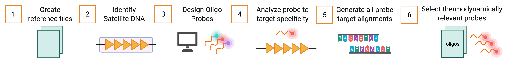
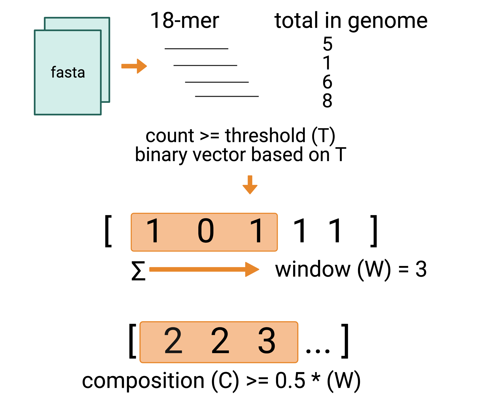
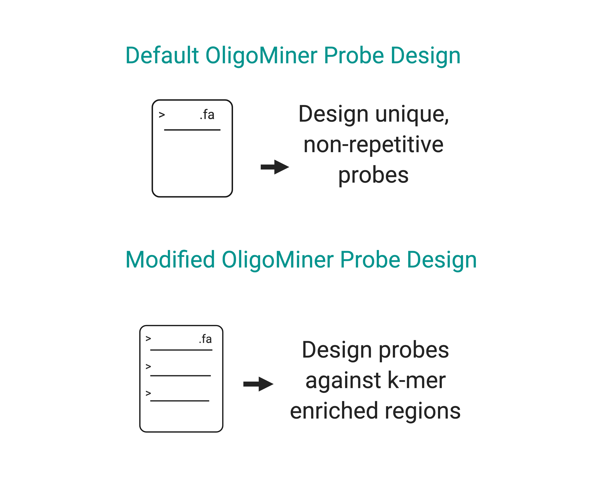
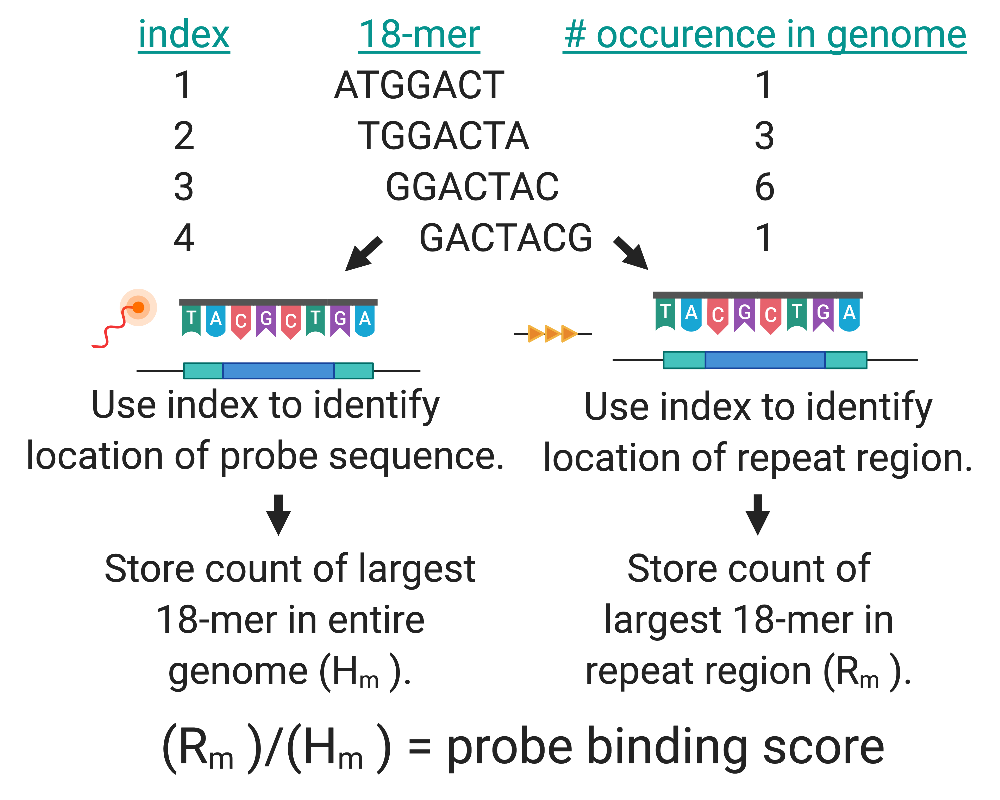
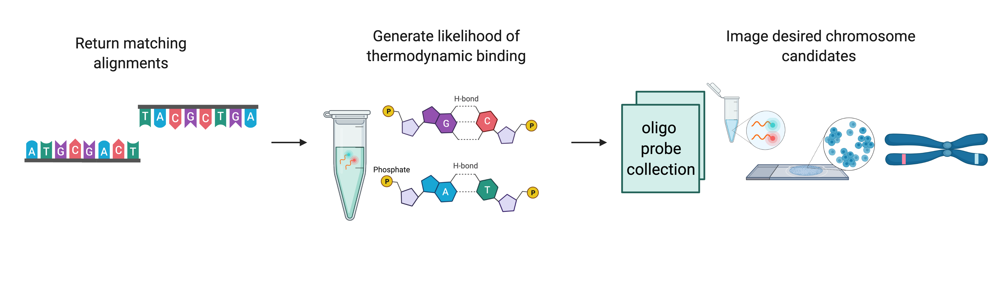

# Pipeline Steps

Description of workflow for the Tigerfish pipeline.

## Overview

  

## 1. Generating reference files

## 2. Repeat identification (optional)

  

## 3. Probe design

  

## 4. K-mer based specificity checking

  

## 5. Alignment based filtering

  

## 6. Output and postprocessing

