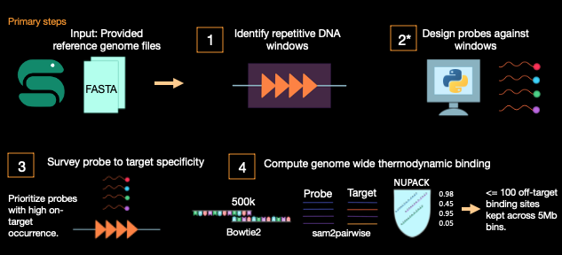
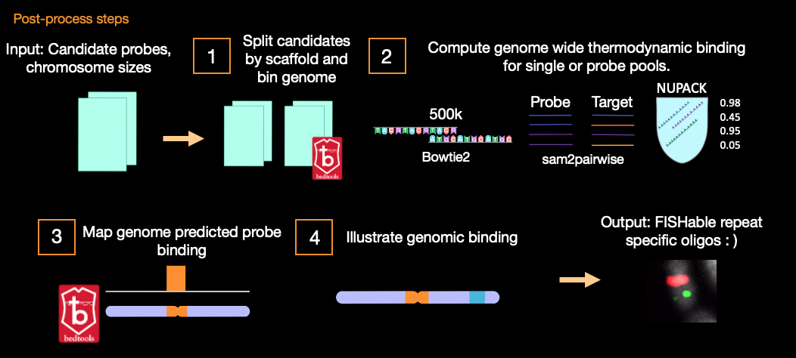

Command Line Interface
######################

`Tigerfish` was written by Robin Aguilar while in the Department of Genome Sciences at the University of Washington.

Official code website: `Tigerfish GitHub Repo <https://github.com/beliveau-lab/TigerFISH>`_

The `Tigerfish` workflow is managed by Snakemake which is used to scale and automatically deploy pipeline jobs in parallel as described in our getting started page.

Essentially, each script in the `Tigerfish` workflow has a set of parameters that may be modified by users. Each script in the main workflow implements these parameters which are called from the pipeline's `config.yml` file. 

As a user, one would only need to modify arguments from the `config.yml` file in order to get `Tigerfish` working. Named arguments for each script are defined in detail below. 

Recommended default parameters are also provided that were used for probe mining in the latest version of the CHM13 (V2.0) genome.  

Named Arguments in `config.yml <https://github.com/beliveau-lab/TigerFISH/blob/master/example_run/main/main_pipeline/config.yml>`_ for main workflow
^^^^^^^^^^^^^^^^^^^^^^^^^^^^^^^^^^^^^^^^^^^^^^^



*Required files for getting started*

**fasta_file**: *File path*. The genomic reference file used for probe design. Should includes all scaffolds of interest in the provided genome in proper FASTA format.

**chrom_sizes_file**: *File path*. The chromosome sizes file containing all scaffolds and scaffold lenths. Take care to make sure **fasta_file** and **chrom_sizes_file** reflect the same genomic version to avoid unexpected behavior. If one is unsure of whether they have the correct `chrom.sizes` file for a given genome build, it may be derived using the following command on a Linux terminal:

```
pip install pyfaidx "|" 
faidx input.fasta -i chromsizes > sizes.genome
```

**defined_coords**: *Boolean flag*. If marked as **TRUE** a BED file path must be provided for the **bed_file** parameter. If parameter is not being used, it should be toggled to **FALSE**.

**bed_file**: Optional file path if Boolean = TRUE for **defined_coords**. This BED file should contain tab seperated positional information (chrom, start, stop) for a target repeat region of interest.

**repeat_discovery**: *Boolean flag*. If marked as **TRUE**, Tigerfish will be implemented to search for repeat specific chromosomes along select scaffolds or the entire geome as long as scaffold names are listed in the **samples** parameter. If **defined_coords** is being used instead, toggle **repeat_discovery** = **FALSE**. 

**bowtie2_indices_given**: *Boolean flag*. If marked **TRUE** users must provide a valid file path to a correctly derived Bowtie2 index. If marked **False** a Bowtie2 index for the queried genome of interest will be made de novo. Examples of how Bowtie file paths are provided are further described in our documentation and tutorials.

**bowtie2_dir**: *File path*. The provided file path to a valid Bowtie2 index. If **bowtie2_indices_given** is labeled **FALSE**, leave this directory path as empty "".  

*Additional parameters*

**assembly**: *String*. The name of the genome assembly being used.

**samples**: *String*. Described as sample in `config.yml` file. Each sample can be one or more scaffolds present in a given genome. Scaffold names should match FASTA file headers.

Example format in config.yml:

sample:<br/>
- "chr1"<br/>
- "chr2"<br/>

Example format in FASTA file:

>chr1<br/>
seq1<br/>
>chr2<br/>
seq2<br/>

**threshold**: *Integer*. `Tigerfish` identifies regions of elevated k-mer counts where these integers are binarized using a user-specified threshold. K-mer counts are computed using Jellyfish. If k-mer counts are >= to this threshold value, they will be assigned a value of 1 while all others receive a 0. This value is only used if **repeat_discovery** is invoked.   

**window**: *Integer*. `Tigerfish` applies a sliding window, along the binary vector generated by the applied **threshold** parameter, yielding for each position a count from 0 to the length of the window. This value is only used if **repeat_discovery** is invoked.

**composition**: *Float*. `Tigerfish` takes counts within each **window** so that they are summed and divided by the window width to yield a normalized count at each base pair where `Tigerfish` then identifies contiguous regions of the genome in which this normalized count exceeds this defined composition score. This value is only used if **repeat_discovery** is invoked.

**file_start**: *Integer*. The start location of where `Tigerfish` makes a 1:1 mapping of the first base of all reported k-mers from the Jellyfish k-mer count output.

**min_length**: *Integer*. The minumum length of any possible designed oligo probe. 

**max_length**: *Integer*. The maximum length of any possible designed oligo probe. 

**min_temp**: *Integer*. The minimum melting temperature of any possible designed oligo probe.

**max_temp**: *Integer*. The maximum melting temperature of any possible designed oligo probe. 

**mer_val**: *Integer*. The k-mer size used to generate Jellyfish hash tables, index files, and for sequence k-mer comparison during filtering analysis.

**enrich_score**: *Float between 0 and 1*. Given the nature of probes designed against repetitive sequences, first it is important to filter probes with low on-target repeat binding based on the aggregate count of a probe’s k-mers within a given repeat target and within the entire human genome. Here, we describe this score as an **enrich_score** which is the sum of all 18-mers derived from a given probe sequence within a repeat target (Rm) over the sum of 18-mers in a given probe sequence within the entire human genome (R<sub>m</sub>/H<sub>m</sub>). Only probes with an enrich_score >= to the proportion provided are kept. 

**copy_num**: *Integer*. Each designed candidate oligo probe is broken down into its respective k-mers using the **mer_val** parameter. Here, the total count of all k-mers for each probe within the probe's target repeat region defines the **copy_num** parameter. Here, this value may be set so that only probes with a value >= **copy_num** will be advance to further downstream filtering. 

**c1_val** and **c2_val**: *Integers*. After preliminary filtering based on target binding specificity, remaining probes within each target repeat are ranked in descending order using a normalization value composed of two constants **c1_val** and **c2_val**. This equation can be described as normalized rank = ((**copy_num**/max **copy_num** value within each target repeat) * **c1_val**) + ((**enrich_score**/max **enrich_score** value within each target repeat) * **c2_val**). These two values may be toggled to determine a rank order to control whether it's preferred to rank probes based on their **copy_number** value or **enrich_score**.

**genome_windows**: *Integer*. All provided genome scaffolds in the chrom.sizes file are binned into windows of this size.  

**target_sum**: *Integer*. `Tigerfish` will add candidate probes based on if their on-target binding score satisfies the **min_on_target** parameter. Candidate probes will be added to the final collection until this **target_sum** is satisfied or no other probe candidates are available. 

**off_bin_thresh**: *Float*. Using the **genome_windows** parameter, predicted thermodynamic binding scores are aggregated over the genomic bins that each probe alignment maps too. Should any one of these bins that doesn't map to the target have a value >= the provided **off_bin_thresh**, that probe will be culled due to the likelihood that it will bind to an additional background target in the genome.

**binding_prop**: *Float*. Using the **genome_windows** parameter, predicted thermodynamic binding scores are aggregated over the genomic bins that each probe alignment maps too. Here, the alignments that occur within the bin(s) mapping to the repeat target are defined as on-target bins whereas all binding events elsewhere are considered off-target bins. This **binding_prop** is the proportion of on-target binding scores/all total binding events.  

**mer_cutoff**: *Float*. To remove redundant probes, all candidate probes at this step are broken down into their respective k-mers based on the **mer_val** parameter after they are rank ordered. Should any probes have a **mer_cutoff** >= to the provided value, it will be culled due to k-mer similar to a probe that was ranked above it. 

**bt2_alignments**: *Integer*. The maximum number of alignmnts to be returned by Bowtie2 for any particular oligo probe. 

**max_pdups_binding**: *Float between 0 and 1*. As probes are stored in the final collection of candidates following genomic alignment, we check to see if valid probes will not form secondary structure with one another. Therefore, we compute NUPACK predicted duplexing probabilities between all valid candidate probe sequences to cull those with binding scores >= the  **max_pdups_binding** value provided.

**seed_length**: *Integer*. `Tigerfish` implements Bowtie2 to align remaining probes to the entire queried genome to ensure that probes will not bind to unexpected binding sites. As described by Bowtie2, there is a tradeoff between speed and sensitivity/accuracy that can be adjusted by setting the seed length, which is the interval between extracted seeds. 

**model_temp**: *Float*. `Tigerfish` implements NUPACK to compute the predicted thermodynamic likelihood that each alignment pair will form duplexes under FISH conditions. The temperature parameter for this model can be modified as a parameter. 

**min_on_target**: *Integer*. Minimum aggregate on target binding score based on thermodynamic binding predictions derived from NUPACK across all returned genomic alignments. 

**max_probe_return**: *Integer*. The maximum total number of probes to be returned (if found) that satisfied final pipeline filtering and parameters. 

**ref_flag**: *Integer, 0 or 1*. Intermediate alignment files may be stored using this parameter if a user selects 1. Because many files during the alignment step are memory intensive, this parameter by default is set to 0 to prevent significant memory overhead. 

Named Arguments in `config.yml <https://github.com/beliveau-lab/TigerFISH/blob/master/example_run/postprocess/config.yml>`_ for the Post-process workflow
^^^^^^^^^^^^^^^^^^^^^^^^^^^^^^^^^^^^^^^^^^^^^^^^^^^^^^^^^^^



**probe_file**: *File path*. A subset output probe file from the main workflow. This file can contain individual or pools of probes from a shared repeat. Multiple chromosomes with unique probes mapping to independent repeat regions are also allowed.

**bowtie2_dir**: *File path*. The provided file path from the main workflow containing Bowtie2 indices for the queried genome of interest.

**assembly**: *String*. The name of the assembly used in the main workflow. Should match the assembly in the main `config.yml` file.

**samples**: *String*. Can include individual scaffolds or multiple scaffolds in bullet list. See `config.yml` fro examples.

**chrom_sizes_file**: *File path*. A file path directing users to the `chrom.sizes` file that matches the appropriate reference FASTA provided.

**genome_windows**: *Integer*. The size genome windows desired to be made by BEDtools.

**bt2_alignments**: *Integer*. The maximum total number of alignments to be returned by Bowtie2.

**seed_length**: *Integer*. `Tigerfish` implements Bowtie2 to align remaining probes to the entire queried genome to ensure that probes will not bind to unexpected binding sites. As described by Bowtie2, there is a tradeoff between speed and sensitivity/accuracy that can be adjusted by setting the seed length, which is the interval between extracted seeds.

**model_temp**: *Float*. `Tigerfish` implements NUPACK to compute the predicted thermodynamic likelihood that each alignment pair will form duplexes under FISH conditions. The temperature parameter for this model can be modified as a parameter.

**bin_thresh**: *Integer*. The provided threshold to note that aggregate thermodynamic binding sites are above this value on any given bin. 


**config.yml parameters**

If you have more questions about any scripts in particular from the main workflow or post process workflow, be sure to check out our GitHub page. Also check out our `Tigerfish` tutorial to see how these scripts come together to generate example data.


