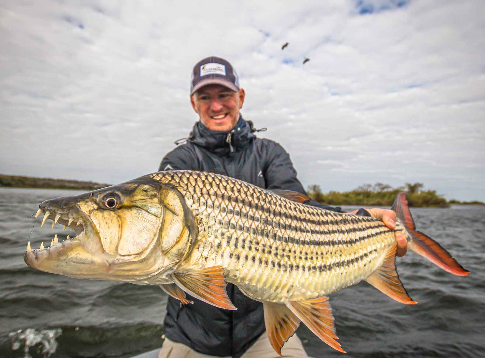

Frequently Asked Questions
==========================

How did Tigerfish get its name?
--------------------------------

If you were to google Tigerfish you might end up finding a picture of a fish that looks like this ...

There are several species belonging to the "tigerfish" family that are found in many rivers and lakes in Africa. The goliath tigerfish is among the most famous tigerfish which are found in the Congo River system. 

Despite the very cool animal facts, the freshwater tigerfish is actually completely unrelated to how Tigerfish as a tool got it's name. During development, the original goal of our tool was to design DNA oligo probes that can specifically target tandem repeats with high specificity. Because our method was a technology development project that implements FISH methods, we wanted to find a way to incorporate the "T" and "R" in tandem repeat into our project's name. The name Tigerfish ended up being the result of this creative process. 

We've also had friends and colleagues share that perhaps tiger stripes are naturally repetitive in nature but we're grateful the tool has a memorable name!

Who designed your logo?
-----------------------

Robin Aguilar was a grad student at UW Genome Sciences from 2018 - 2023 where they worked in the Beliveau and Noble labs during their time as a grad student. They were the primary developer for the project and studied repetitive DNA biology as a part of their thesis work. They are also a freelance graphic designer and wanted to incorporate tiger stripes as a way to represent the tool specifically targeting large arrays of repetitive DNA across chromosomes using FISH. 

What input and output formats does Tigerfish support?
-----------------------------------------------------

Tigerfish can directly read files that are genomic FASTA files or tab-delimited BED files from the main pipeline's config.yml file.

Currently Tigerfish can output tab related tables genreated by `pandas.DataFrame` that provides output probes. A supplementary table that provides the probes' target region, total aggregate on/off target probe binding are also provided for ease of viewing.

Adding additional support for input and output formats is something we're interested in and working on.

For more information on the input and output file formats, please consider reading our tutorial page. 

How do I do <insert task> with Tigerfish?
---------------------------------------

The best way to get help with these kinds of questions is to reach out directly to the project's GitHub repo and submit questions to Robin. We are in the process of constructing a Tigerfish discusion board so that all users can benefit from Q&A. 

Help, I just got a weird error! What should I do?
-------------------------------------------------

First, make sure that you have read the documentation on this site and can't find an answer to what went wrong. Also verify that you wete able to get Tigerfish installed properly through your command line system. Finally, reach out to Robin describing your error and in the future, please check the Tigerfish discussion board to see if anyone else has encountered your error.

If you still have a problem, please don't hesitate to file an issue on our GitHub page. It may very well be that you found lapses in our documentation or a bug that would also be frustrating for others to navigate. When you do open an issue, please make every effort to provide reproducible examples that can demonstrate this error you've run into. Having examples that are easy to document with screenshots if possible will make bug fixes much faster and easier to communicate what went wrong. 
