Tigerfish User Tutorials
########################

Overview
--------
These tutorials for **Tigerfish** are intended to provide users with an overview of the tool's features and functionality. Here, users will learn how to run **Tigerfish** using *"Repeat Identification Mode"* and *"Probe Design Mode"* using example cases and real data in the CHM13 v2.0 genome. Following this tutorial, users will have all the resources to run **Tigerfish** for their own research applications. 

This tutorial guide was written in mind for those who are newer to running these scripts in a command line environment. These tutorials will help users ensure that they have installed **Tigerfish** properly on their own command line system. 

So let's get started! |:microscope:| |:tiger:|

Background
==========

The following tutorial is used to cover **Tigerfish** functionality on a toy genome composed of the chr4 D4Z4 and chrX DXZ4 repeats which is derived from the latest version (v2.0) of the `CHM13 human <https://github.com/marbl/CHM13>`_ genome. 

This reference file can be found within the project's Github repo `here <https://github.com/beliveau-lab/TigerFISH/tree/master/example_run/repeat_discovery_test/data/example.fa>`_. 

Users will download the full CHM13 v2.0 reference file later in this tutorial, to work on real-world data. 

For the test genome cases, there are three directories that exist which will be referenced in this tutorial. 

1. First, we will walk through *Repeat Identification Mode* on a Test Genome and this directory is located `here <https://github.com/beliveau-lab/TigerFISH/tree/master/example_run/repeat_discovery_test>`_. 

2. Next, we will move through the *Probe Design Mode* directory which can be found `here <https://github.com/beliveau-lab/TigerFISH/tree/master/example_run/probe_design_test>`_. 

3. Lastly, we will move into the real-world examples in the main pipeline with CHM13 v2.0 using *Probe Design Mode* from the newly annotated chr9 HSAT repeat which is found `here <https://github.com/beliveau-lab/TigerFISH/tree/master/example_run/probe_design_chm13>`_.  

It's important to note that the first two test directories are static meaning that the config.yml files have been organized to run **Tigerfish** for expected behavior in each directory. Therefore, users only need to execute the run_pipeline.sh script contained in each directory. 

At UW Genome Sciences, users have access to the departmental Sun Grid Cluster Engine, which is used to deploy cluster compute jobs. Templates for how to run **Tigerfish** with such a file system can be found at the root directory of the **Tigerfish** GitHub `here <https://github.com/beliveau-lab/TigerFISH/tree/master/sun_grid_run_template>`_. This is intended to be a generalizable template that may be used to run **Tigerfish** jobs in independent directories to run in any command line environment. 

To begin, we will describe some context for how **Tigerfish** is deployed by covering the config.yml file and appropriate run_pipeline.sh scripts found in each directory.

Config file
===========

**Tigerfish** is a command line workflow that is implemented using Snakemake. This `config.yml <https://github.com/beliveau-lab/TigerFISH/blob/master/example_run/probe_design_chm13/config.yml>`_ file summarizes parameters that users are able to modify. 

However, we provide default parameters summarized in our paper for recommended use. These parameters for probe design are also described within the command line definitions page. 

Repeat Identification Mode on a Test Genome
-------------------------------------------

*Repeat Identification Mode* is intended to be used when a user provides a given genome FASTA file and is perhaps unsure of where their target repeat regions of interest lie within the genomic sequence. Another valid use case for this option is if a user wants to perform genome-wide probe mining over all regions that Tigerfish deems as repetitive. In this case, the example genome FASTA contains a small subset of the DXZ4 and D4Z4 repeats. 

Here's a walkthrough of all the input files provided to get started with running Tigerfish in this example case:

**Pipeline input**

- Genome FASTA reference file
- chrom.sizes file
- Bowtie2 indices (optional)

The test genome file described as **example.fa**: 

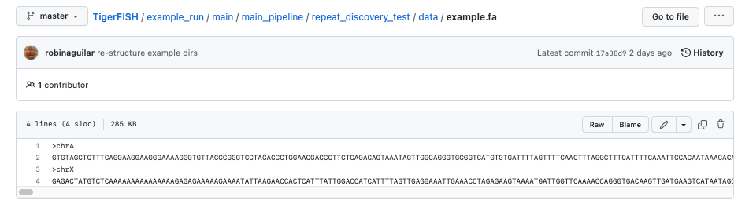
     
The test genome chrom.sizes file described as **test_chrom.sizes**:

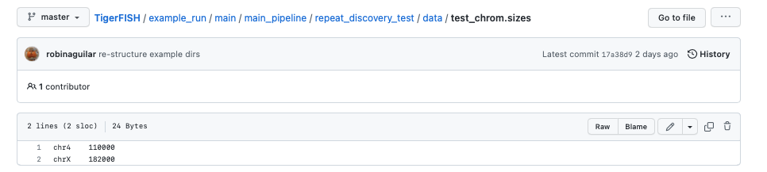
     
The Bowtie2 directories for this test genome reference which are found in the path **data/bt2/** relative to the config.yml file:

.. image:: imgs/bt2_repeat_disc.png
     :width: 500
     :alt: Tigerfish Bowtie2 indices for example genome

**Note**: Bowtie2 directories against the queried genome are optional to provide. If you want this made de novo, you can specify this by toggling the relevant Bowtie2 flag in the config.yml file as shown below. 

**Pipeline output**

All expected output files can be found within `this directory <https://github.com/beliveau-lab/TigerFISH/tree/master/example_run/repeat_discovery_test/expected_output>`_. 

Here, a collection of probes for both repeats found on each scaffold are provided in independent directories.

**Pipeline executables**

The **config.yml** file which has preset parameters that **do not** need to be modified for proper execution:
     
.. code-block:: bash

     
    #path to genome fasta
    fasta_file: "data/example.fa"

    #path to file containing primary chromosome sizes
    chrom_sizes_file: "data/test_chrom.sizes"

    #if coordinates are provided for probe design, file goes here
    bed_file: "data/dxz4_synthetic.bed"

    #option for probe design that directs pipeline implementation
    defined_coords: "FALSE"
    repeat_discovery: "TRUE"
    probe_cand_binding: "FALSE"
    
    bowtie2_indices_given: "TRUE"
    jf_hash_given: "FALSE"
    jf_count_given: "FALSE"
    chrom_idx_given: "FALSE"
    chrom_fasta_given: "FALSE"

    assembly: "chm13"
    bowtie2_dir: "data/bt2/"
    jf_hash_dir: ""
    jf_count_dir: ""
    chrom_idx_dir: ""
    chrom_fasta_dir: ""
    probe_binding_file: ""

    #all chromosomes present in bed file or required for probe discovery are listed here
    samples:
        - "chr4"
        - "chrX"

    #parameters for repeat_ID step
    window: 4000

    threshold: 5

    composition: 0.25

    file_start: 0

    #parameters for probe_design step
    min_length: 36

    max_length: 41

    min_temp: 42
 
    max_temp: 47

    #parameters for kmer_filter script
    mer_val: 18

    c1_val: 1

    c2_val: 5

    #parameters used for probe_mer_filter script
    enrich_score: 0.50

    copy_num: 10

    #parameters used in alignment_filter script
    genome_windows: 5000000

    thresh_window: 100000

    binding_prop: 0.70

    target_sum: 5000

    off_bin_thresh: 100 

    mer_cutoff: 0.95

    bt2_alignments: 500000

    max_pdups_binding: 0.90

    seed_length: 15

    model_temp: 69.5

    min_on_target: 25

    max_probe_return: 40

    align_thresh: 10

    ref_flag: 0
              
**Note**: It's *extremely* important to list all specific scaffolds of interest where repeat discovery will happen. In this case since we are interested in designing probes against this entire test genome, we list both chromosomes as their names are found within the genome FASTA file. Here, you can see that "chr4" and "chrX" are listed appropriately. If one wanted to perform repeat discovery on just one of these scaffolds, the others need not be listed.
     
The **run_pipeline.sh** script is what is used to execute the pipeline:

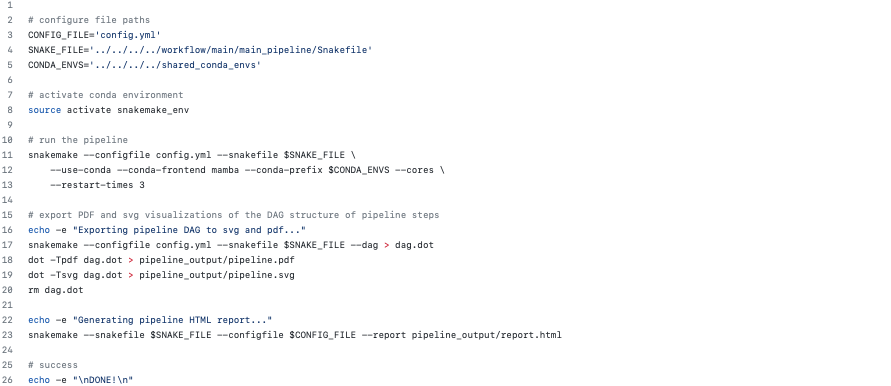
     
     
To check if the expected output files match to what is generated after you run the pipeline you can use the script **run_check_repeatID.sh**:

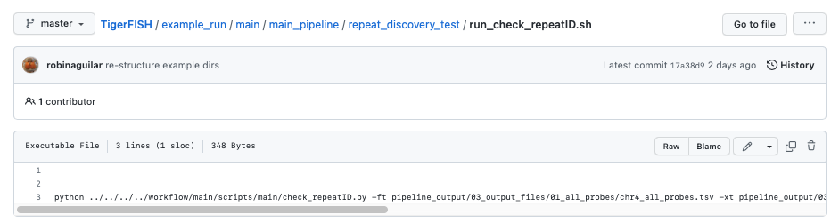
     
     
**Let's walkthrough**

1. Begin by opening your command line terminal and making sure that conda is installed for your system as described in the Install section on our Getting Started page. Please proceed with installing Mamba as needed to assist with Snakemake installation.

2. Clone the Tigerfish repo into an empty directory and create the active environment as shown on the Installation page to activate the snakemake_env. Here, I already have this conda environment installed which is why I received the `CondaValueError`. But now we are ready to navigate to our test directory!

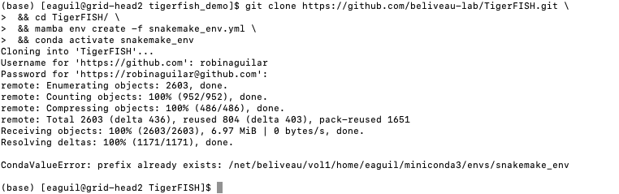

3. Navigate to the repeat discovery test directory which may be found here relative to the Tigerfish home directory:

.. code-block:: bash

     cd example_run/repeat_discovery_test/

4. Within the `repeat_discovery_test` directory, you should be met with the following sub-directories and files once this command is executed:

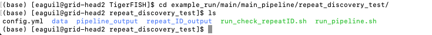

5. Now all that is needed is to execute the run_pipeline.sh. This may be done by entering the following command:

.. code-block:: bash

     . run_pipeline.sh
     
You will see that Tigerfish is solving and downloading relevant remote packages. This may take a few minutes to resolve before execution.

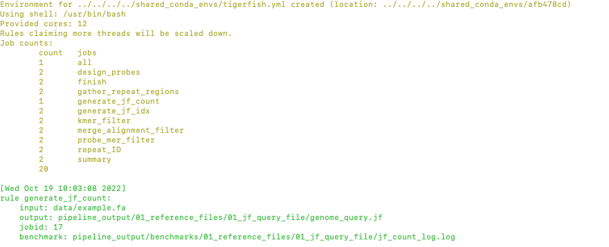

6. Now you can see that Tigerfish is successfully running! Output files will be populated in the `pipeline_output/` directory. Which will be shown when you are greeted with the "DONE!" message. 

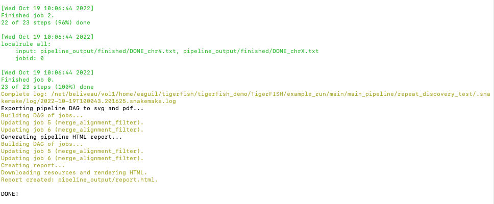

7. If you want to compare if your files match what should be found in the expected output directories, you can run this check script like so: 

.. code-block:: bash

     . run_check_repeatID.sh

If everything is correct, this script will provide a message declaring: "Test run matches Tigerfish expected output!". This is shown below:

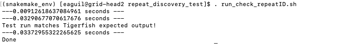

8. Now you're done! Congrats on running *Repeat Discovery Mode*! |:tada:|

If you happen to want to see a video of this happening as a real-time demo, you can watch this example `here <https://vimeo.com/762384749>`_.

Now you're ready to move into the *Probe Design Mode* tutorial!

Probe Design Mode on a Test Genome
----------------------------------

*Probe Design Mode* is intended for users who know where their repeat target is and they are interested in probe design against a specific region or set of regions. 

**Pipeline Input**

- Genome FASTA reference file
- chrom.sizes file
- Bowtie2 indices (optional)
- BED file of repeat region coordinates

To implement this run mode, users must also provide a BED file as the **only** additional input to what is described in the *Repeat Identification Mode* tutorial. Here, this BED file can be viewed in `this directory <https://github.com/beliveau-lab/TigerFISH/blob/master/example_run/probe_design_test/data/dxz4_synthetic.bed>`_. In this exercise, probes will only be designed against the selected DXZ4 repeat section.

**Pipeline Output**

All expected output files can be found within `this directory <https://github.com/beliveau-lab/TigerFISH/tree/master/example_run/probe_design_test/expected_output>`_. 

Here, a collection of probes for the desired repeat region is provided in its own directory.

**Pipeline executable**

The **config.yml** file which has preset parameters that **do not** need to be modified for proper execution:

.. code-block:: bash

     
    #path to genome fasta
    fasta_file: "data/example.fa"

    #path to file containing primary chromosome sizes
    chrom_sizes_file: "data/test_chrom.sizes"

    #if coordinates are provided for probe design, file goes here
    bed_file: "data/dxz4_synthetic.bed"

    #option for probe design that directs pipeline implementation
    defined_coords: "TRUE"
    repeat_discovery: "FALSE"
    probe_cand_binding: "FALSE"
    
    bowtie2_indices_given: "TRUE"
    jf_hash_given: "FALSE"
    jf_count_given: "FALSE"
    chrom_idx_given: "FALSE"
    chrom_fasta_given: "FALSE"

    assembly: "chm13"
    bowtie2_dir: "data/bt2/"
    jf_hash_dir: ""
    jf_count_dir: ""
    chrom_idx_dir: ""
    chrom_fasta_dir: ""
    probe_cand_file: ""

    #all chromosomes present in bed file or required for probe discovery are listed here
    samples:
        - "chrX"

    #parameters for repeat_ID step
    window: 4000

    threshold: 5

    composition: 0.25

    file_start: 0

    #parameters for probe_design step
    min_length: 36

    max_length: 41

    min_temp: 42
 
    max_temp: 47

    #parameters for kmer_filter script
    mer_val: 18

    c1_val: 1

    c2_val: 5

    #parameters used for probe_mer_filter script
    enrich_score: 0.50

    copy_num: 10

    #parameters used in alignment_filter script
    genome_windows: 5000000

    thresh_window: 100000

    binding_prop: 0.70

    target_sum: 5000

    off_bin_thresh: 100 

    mer_cutoff: 0.95

    bt2_alignments: 500000

    max_pdups_binding: 0.90

    seed_length: 15

    model_temp: 69.5

    min_on_target: 25

    max_probe_return: 40

    align_thresh: 10

    ref_flag: 0
    
**Note**: It's *extremely* important to list all specific scaffolds of interest where probe design will happen. In this case since we are interested in designing probes against chrX, we list this chromosome only as "chrX" as shown in the config.yml file. 

Here, the provided organization of this directory where the *Probe Design Mode* tutorial takes place also contains a `run_pipeline.sh` script and `run_check_defined_coords.sh`. This structure mirrors the organization of the *Repeat Discovery Mode* test tutorial making this walkthrough fairly similar in behavior.

**Let's walkthrough**

1. Return to the main home directory in the **Tigerfish** directory structure to enter the probe design mode test directory using the following command:

.. code-block:: bash

     cd example_run/probe_design_test/

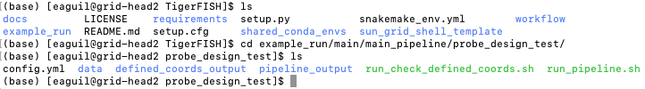
     
     
2. Enter the following command to execute the pipeline. 

.. code-block:: bash

     . run_pipeline.sh

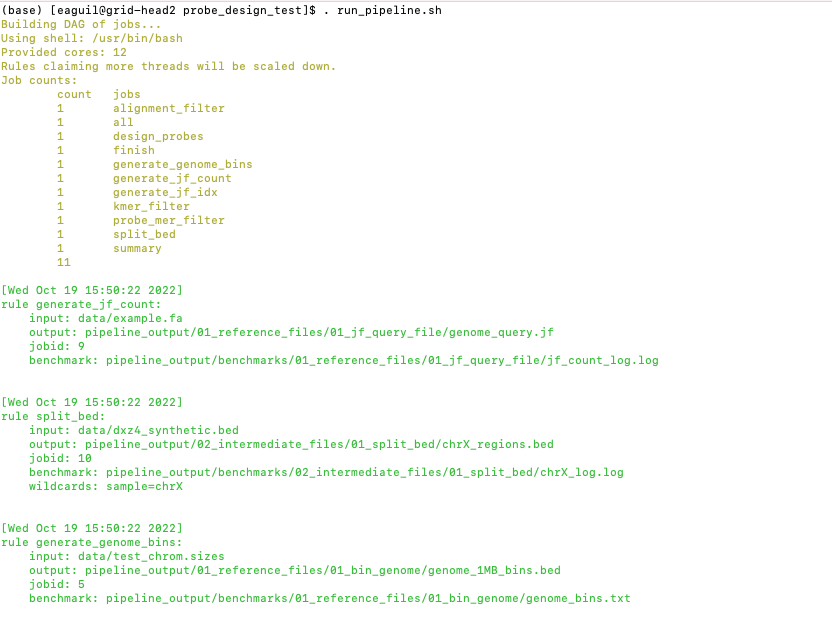
     
     
3. Now you will see that this pipeline has completed execution and you will receive a message declaring "DONE"!

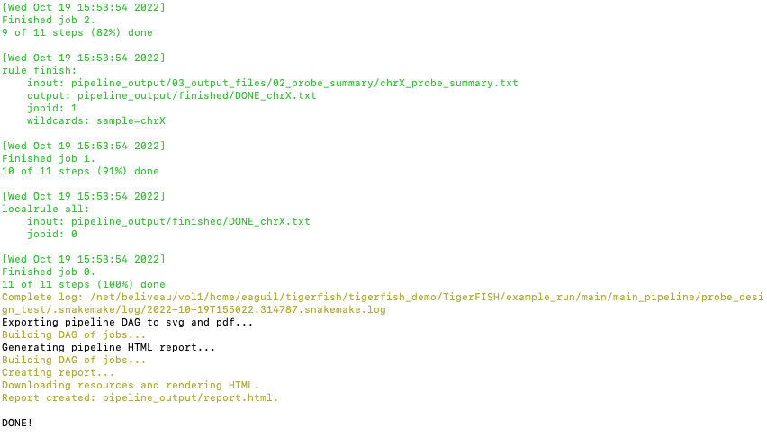
    
    
4. To check if the pipeline output matches expected behavior, enter the following command to return the checked statement. 

.. code-block:: bash

     . run_check_defined_coords.sh

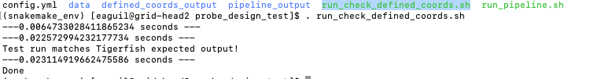

5. Great work! Congrats on running *Probe Design Mode*! |:tada:| |:sparkles:|

If you happen to want to see a video of this happening as a real-time demo, you can watch this example `here <https://vimeo.com/762385186>`_.

Probe Binding Mode on a Test Genome
----------------------------------

1. Return to the main home directory in the **Tigerfish** directory structure to enter the probe design mode test directory using the following command:

.. code-block:: bash

     cd example_run/probe_candidate_binding_test/
     
2. Enter the following command to execute the pipeline. 

.. code-block:: bash

     . run_pipeline.sh
     
     
3. Now you will see that this pipeline has completed execution and you will receive a message declaring "DONE"!
    

4. Nice! Congrats on running *Probe Binding Mode*! This means that all run modes of **Tigerfish** have passed in the test genome! |:tada:| |:sparkles:|

Comparing config.yml files between *Repeat Discovery Mode* and *Probe Design Mode*
----------------------------------------------------------------------------------

It's important to understand the distinct parameters that are being changed to toggle between *Repeat Discovery Mode* and *Probe Design Mode*. The key distinction are which parameters are being toggled to "TRUE" and "FALSE" for expected behavior. Let's take a look at where these config.yml files differ:

*Repeat Discovery Mode*

.. code-block:: bash

     
    #path to genome fasta
    fasta_file: "data/example.fa"

    #path to file containing primary chromosome sizes
    chrom_sizes_file: "data/test_chrom.sizes"

    #if coordinates are provided for probe design, file goes here
    bed_file: "data/dxz4_synthetic.bed"

    #option for probe design that directs pipeline implementation
    defined_coords: "FALSE"
    repeat_discovery: "TRUE"
    probe_cand_binding: "FALSE"
    
    bowtie2_indices_given: "TRUE"
    jf_hash_given: "FALSE"
    jf_count_given: "FALSE"
    chrom_idx_given: "FALSE"
    chrom_fasta_given: "FALSE"

    assembly: "chm13"
    bowtie2_dir: "data/bt2/"
    jf_hash_dir: ""
    jf_count_dir: ""
    chrom_idx_dir: ""
    chrom_fasta_dir: ""
    probe_cand_file: ""

*Probe Design Mode*

.. code-block:: bash

     
    #path to genome fasta
    fasta_file: "data/example.fa"

    #path to file containing primary chromosome sizes
    chrom_sizes_file: "data/test_chrom.sizes"

    #if coordinates are provided for probe design, file goes here
    bed_file: "data/dxz4_synthetic.bed"

    #option for probe design that directs pipeline implementation
    defined_coords: "TRUE"
    repeat_discovery: "FALSE"
    probe_cand_binding: "FALSE"
    
    bowtie2_indices_given: "TRUE"
    jf_hash_given: "FALSE"
    jf_count_given: "FALSE"
    chrom_idx_given: "FALSE"
    chrom_fasta_given: "FALSE"

    assembly: "chm13"
    bowtie2_dir: "data/bt2/"
    jf_hash_dir: ""
    jf_count_dir: ""
    chrom_idx_dir: ""
    chrom_fasta_dir: ""
    probe_cand_file: ""

Here, the key difference in behavior can be controlled based on whether `defined_coords` = "TRUE" and `repeat_discovery` = "FALSE" to drive *Probe Design Mode* and vice versa for *Repeat Discovery Mode*. Be mindful that if one of these parameters is set to TRUE, the other must be set to FALSE or else the pipeline will be exited.

Probe Design Mode on chr9 HSAT in CHM13 v2.0
---------------------------------------------

For this portion of the tutorial, we will be implementing probe design mode on real-world data using the CHM13 v2.0 genome to mine probes from the newly annotated chr9 human satellite (HSAT) repeat. Since we've already done a walkthrough of probe design mode on our test files, we will just begin with a walkthrough of how to begin running this process and what files need to me modified for this exercise.

**Note**: In the data directory you will see that the chrom.sizes file for this genome assembly and BED file with the chr9 HSAT coordinates are already provided.

For reference, we will be working in this directory shown here: 

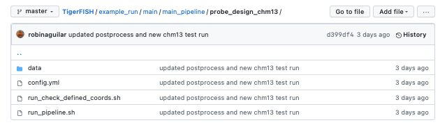

**Let's walkthrough**

1. From the Tigerfish home directory, navigate to the following path:

.. code-block:: bash

     cd example_run/probe_design_chm13/data
     
     
2. Next, we will download the CHM13 v2.0 genome into this directory. This genome build is found `here <https://github.com/marbl/CHM13>`_. Under assembly releases, be sure to get the link for the file chm13v2.0.fa.gz. You can download the file using the following command. This may take a few moments. 

.. code-block:: bash

     wget https://s3-us-west-2.amazonaws.com/human-pangenomics/T2T/CHM13/assemblies/analysis_set/chm13v2.0.fa.gz

3. You can unzip this file by entering:

.. code-block:: bash

     gunzip chm13v2.0.fa.gz
     
3. Now you need to update the path in the config.yml to execute the pipeline with the proper genome build path. So return out one directory to the config.yml file and include the path to the chm13 genome. This will look like the following: 

.. code-block:: bash

    #path to CHM13 genome fasta
    fasta_file: ""

    #path to file containing primary chromosome sizes
    chrom_sizes_file: "data/chm13.chrom.sizes"

    #if coordinates are provided for probe design, file goes here
    bed_file: "data/chm13_chr9_hsat_array.bed"

    #option for probe design that directs pipeline implementation
    defined_coords: "TRUE"
    repeat_discovery: "FALSE"
    probe_cand_binding: "FALSE"
    
    bowtie2_indices_given: "FALSE"
    jf_hash_given: "FALSE"
    jf_count_given: "FALSE"
    chrom_idx_given: "FALSE"
    chrom_fasta_given: "FALSE"

    assembly: "chm13"
    jf_hash_dir: ""
    jf_count_dir: ""
    chrom_idx_dir: ""
    chrom_fasta_dir: ""
    bowtie2_dir: ""
    probe_cand_file: ""
    
    #all chromosomes present in bed file or required for probe discovery are listed here
    samples:
        - "chr9"

    #parameters for repeat_ID step
    window: 4000

    threshold: 5

    composition: 0.25

    file_start: 0

    #parameters for probe_design step
    min_length: 25

    max_length: 50

    min_temp: 42

    max_temp: 52

    #parameters for kmer_filter script
    mer_val: 18

    c1_val: 1

    c2_val: 5

    #parameters used for probe_mer_filter script
    enrich_score: 0.70

    copy_num: 40

    #parameters used in alignment_filter script
    genome_windows: 5000000

    thresh_window: 100000

    binding_prop: 0.70

    off_bin_thresh: 100

    target_sum: 20000

    mer_cutoff: 0.95

    bt2_alignments: 500000

    max_pdups_binding: 0.90

    seed_length: 15

    model_temp: 69.5

    min_on_target: 25

    max_probe_return: 20

    align_thresh: 10

    ref_flag: 0
         
4. Now you are ready to run this process! For Sun Grid users, it is recommended that you submit this as a cluster job. Templates of how to do this to your shell script to make it executable for cluster job submissions in provided in the Tigerfish home directory. 

5. Once completed, you can check this job process based on expected output. Here only the probe file was kept from the full expected output to minimize memory use. To check if the output matches what is in the expected output directory, simply run the following command:

.. code-block:: bash

     . run_check_defined_coords.sh 
     
     
Congrats! You've designed a real probe that will work to visualize the chr9 HSAT array uniquely! 

Final thoughts
--------------

We hope this tutorial provides a comprehensive overview of what is needed to get users started with Tigerfish. Happy FISHing for new repeats!
