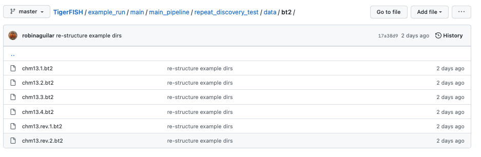
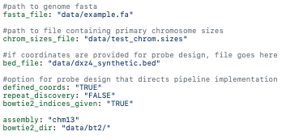

Tigerfish User Tutorials
########################

Overview
--------
These tutorials for **Tigerfish** are intended to provide users with an overview of the tool's features and functionality. Here, users will learn how to run **Tigerfish** using *"Repeat Identification Mode"* and *"Probe Design Mode"* using example cases and on real data in the CHM13 V2.0 genome. Following implementation of the main pipeline, users will also walk through example and real-world cases of the *post-process pipeline*. Following this tutorial, users will have all the resources to run **Tigerfish** for their own research applications. 

This tutorial guide was written in mind for those who are newer to running these scripts in a command line environment. These tutorials will help users ensure that they have installed and are running **Tigerfish** properly on their own command line system. 

So let's get started! |:microscope:| |:tiger:|

Background
==========

The following tutorial is used to cover **Tigerfish** functionality on a toy genome composed of the chr4 D4Z4 and chrX DXZ4 repeats which is derived from the latest version (v.2.0) of the `CHM13 human <https://github.com/marbl/CHM13>`_ genome. 

This reference file can be found within the project's Github repo `here <https://github.com/beliveau-lab/TigerFISH/tree/master/example_run/main/main_pipeline/repeat_discovery_test/data/example.fa>`_. 

Users will download the full CHM13 V2.0 reference file later in this tutorial, to work on real-world data. 

For the test genome cases, there are two static directories that exist which will be referenced in this tutorial. First, we will walk through *Repeat Identification Mode* on a Test Genome and this directory is located `here <https://github.com/beliveau-lab/TigerFISH/tree/master/example_run/main/main_pipeline/repeat_discovery_test>`_. 

Next, we will move through the *Probe Design Mode* directory which can be found `here <https://github.com/beliveau-lab/TigerFISH/tree/master/example_run/main/main_pipeline/probe_design_test>`_. 

Following execution of both run-modes in the main pipeline, we will proceed with the *post-process pipeline* which exists `here <https://github.com/beliveau-lab/TigerFISH/tree/master/example_run/postprocess/dxz4_test>`_. 

Lastly, we will move into the real-world examples in the main pipeline with CHM13 V2.0 using *Probe Design Mode* and relevant post-process data on real oligo probes mined from the newly annotated chr9 HSAT repeat. 

It's important to note that these directories are static meaning that the config.yml files have been organized to run Tigerfish for expected behavior in each directory. In other words, the only thing that users will need to execute to validate their results in each directory is the run_pipeline.sh scripts independently. 

At UW Genome Sciences, users have access to the departmental Sun Grid Cluster Engine, which is used to deploy cluster compute jobs. Templates for how to run Tigerfish with such a file system can be found here. Even if you are not using the Sun Grid Engine, Tigerfish may be executed locally and all scripts are currently configured for generalizeable use in a command line environment.

To begin, we will describe some context for how Tigerfish is deployed by covering the config.yml file and appropriate run_pipeline.sh scripts found in each directory.

Config file
===========

**Tigerfish** is a command line workflow that is implemented using Snakemake. This `config.yml <https://github.com/beliveau-lab/TigerFISH/blob/master/example_run/main/main_pipeline/config.yml>`_ file summarizes parameters that users are able to modify for their own research. However, we provide default parameters summarized in our paper for recommended use. These parameters for probe design are also described within this documentation along with definitions on our command line definitions page. 

For the example test files and real-world data, these config.yml files in each of these directories have already been modified for use with example and template files. The only modification required will be to list the path to the CHM13 V2.0 genome in the real-world data example, but we walk through how to do this when we get to this step :). 

Repeat Identification Mode on a Test Genome
-------------------------------------------

*Repeat Identification Mode* is intended to be used when a user provides a given genome FASTA file and is perhaps unsure of where their target repeat regions of interest lie within the genomic sequence. Another valid use case for this option is if a user wants to perform genome-wide probe mining over all regions that Tigerfish deems as repetitive. In this case, the example genome FASTA contains a small subset of the DXZ4 and D4Z4 repeats. 

Here's a walkthrough of all the input files provided to get started with running Tigerfish in this example case:

**Pipeline input**

- Genome FASTA reference file
- chrom.sizes file
- Bowtie2 indices (optional)

The test genome file described as **example.fa**: 

.. image:: imgs/repeat_disc_fasta.png
     :width: 500
     :alt: Tigerfish example genome FASTA
     
The test genome chrom.sizes file described as **test_chrom.sizes**:

.. image:: imgs/chrom_sizes_repeat_disc.png
     :width: 500
     :alt: Tigerfish example genome chrom.sizes file
     
The Bowtie2 directories for this test genome reference which are found in the path **data/bt2/** relative to the config.yml file:

**Note**: Bowtie2 directories against the queried genome are optional to provide. If you want this made de novo, you can specify this by toggling the relevant Bowtie2 flag in the config.yml file as shown below. 

**Pipeline output**

All expected output files can be found within `this directory <https://github.com/beliveau-lab/TigerFISH/tree/master/example_run/main/main_pipeline/repeat_discovery_test/repeat_ID_output>`_. 

Here, a collection of probes for both repeats found on each scaffold are provided in independent directories.

**Pipeline executables**

The **config.yml** file which has preset parameters that **do not** need to be modified for proper execution:

     
**Note**: It's *extremely* important to list all specific scaffolds of interest where repeat discovery will happen. In this case since we are interested in designing probes against this entire test genome, we list both chromosomes as their names are found within the genome FASTA file. Here, you can see that "chr4" and "chrX" are listed appropriately. If one wanted to perform repeat discovery on just one of these scaffolds, the others need not be listed.
     
The **run_pipeline.sh** script is what is used to execute the pipeline:

     
     
To check if the expected output files match to what is generated after you run the pipeline you can use the script **run_check_repeatID.sh**:

.. image:: imgs/check_repeat_disc.png
     :width: 500
     :alt: Tigerfish check if repeat discovery mode outputs are as expected
     
     
**Let's walkthrough**

1. Begin by opening your command line terminal and making sure that conda is installed for your system as described in the Install section on our Getting Started page. Please proceed with installing Mamba as needed to assist with Snakemake installation.

2. Clone the Tigerfish repo into an empty directory and create the active environment as shown on the Installation page to activate the snakemake_env. Here, I already have this conda environment installed which is why I received the `CondaValueError`. But now we are ready to navigate to our test directory!

.. image:: imgs/step_2_repeat_disc.png
     :width: 500
     :alt: Screenshot declaring that the conda environment is installed.

3. Navigate to the repeat discovery test directory which may be found here relative to the Tigerfish home directory:

.. code-block:: bash

     cd example_run/main/main_pipeline/repeat_discovery_test/

4. Within the `repeat_discovery_test` directory, you should be met with the following sub-directories and files once this command is executed:

.. image:: imgs/step_4_repeat_disc.png
     :width: 500
     :alt: Screenshot demonstrating that the correct repeat discovery directory has been entered

5. Now all that is needed is to execute the run_pipelin.sh. This may be done by entering the following command:

.. code-block:: bash

     . run_pipeline.sh
     
You will see that Tigerfish is solving and downloading relevant remote packages. This may take a few minutes to resolve before execution.

6. Now you can see that Tigerfish is successfully running! Output files will be populated in the `pipeline_output/` directory. Which will be shown when you are greeted with the "DONE!" message. 

.. image:: imgs/step_6_repeat_disc.png
     :width: 500
     :alt: Screenshot showing that Tigerfish is successfully running and has completed.

7. If you want to compare if your files match what should be found in the expected output directories, you can run this check script like so: 

.. code-block:: bash

     . run_check_repeatID.sh

If everything is correct, this script will provide a message declaring: "Test run matches Tigerfish expected output!". This is shown below:

8. Now you're done! Congrats on running *Repeat Discovery Mode*! |:tada:|

If you happen to want to see a video of this happening as a real-time demo, you can watch this example below:

.. raw:: html 

<video src="_static/repeat_disc_video.mp4">   

Now you're ready to move into the *Probe Design Mode* tutorial!

Probe Design Mode on a Test Genome
----------------------------------

*Probe Design Mode* is intended for users who know where their repeat target is and they are interested in probe design against a specific region or set of regions. 

**Pipeline Input**

- Genome FASTA reference file
- chrom.sizes file
- Bowtie2 indices (optional)
- BED file of repeat region coordinates

To implement this run mode, users must also provide a BED file as the **only** additional input to what is described in the *Repeat Identification Mode* tutorial. Here, this BED file can be viewed in this directory. In this exercise, probes will only be designed against the selected DXZ4 repeat section.

**Pipeline Output**

All expected output files can be found within `this directory <https://github.com/beliveau-lab/TigerFISH/tree/master/example_run/main/main_pipeline/probe_design_test/defined_coords_output>`_. 

Here, a collection of probes for the desired repeat region is provided in its own directory.

**Pipeline executable**

The **config.yml** file which has preset parameters that **do not** need to be modified for proper execution:

**Note**: It's *extremely* important to list all specific scaffolds of interest where probe design will happen. In this case since we are interested in designing probes against chrX, we list this chromosome only as "chrX" as shown in the config.yml file. 

Here, the provided organization of this directory where the *Probe Design Mode* tutorial takes place also contains a `run_pipeline.sh` script and `run_check_defined_coords.sh`. This structure mirrors the organization of the *Repeat Discovery Mode* test tutorial making this walkthrough fairly similar in behavior.

**Let's walkthrough**

1. Return to the main home directory in the Tigerfish directory structure to enter the probe design mode test directory using the following command:

.. code-block:: bash

     cd example_run/main/main_pipeline/probe_design_test/

.. image:: imgs/step_1_probe_design.png
     :width: 500
     :alt: Screenshot showing that the directory for the probe design test. 
     
     
2. Enter the following command to execute the pipeline. 

.. code-block:: bash

     . run_pipeline.sh

.. image:: imgs/step_2_probe_design.png
     :width: 500
     :alt: Screenshot showing that probe design test is being executed. 
     
     
3. Now you will see that this pipeline has completed execution and you will receive a message declaring "DONE"!

    
    
4. To check if the pipeline output matches expected behavior, enter the following command to return the checked statement. 

.. code-block:: bash

     . run_check_defined_coords.sh

.. image:: imgs/step_4_probe_design.png
     :width: 500
     :alt: Screenshot showing that probe design test matched expected behavior. 

5. Great work! Congrats on running *Probe Design Mode*! This means that both run modes of Tigerfish have passed! |:tada:| |:sparkles:|

Here's a video of this tutorial:

.. video:: imgs/probe_design_video.mp4
   :width: 500
   :height: 300
   :autoplay:
   :nocontrols:
   

Comparing config.yml files between *Repeat Discovery Mode* and *Probe Design Mode*
----------------------------------------------------------------------------------

It's important to understand the distinct parameters that are being changed to toggle between *Repeat Discovery Mode* and *Probe Design Mode*. The key distinction are which parameters are being toggled to "TRUE" and "FALSE" for expected behavior. Let's take a look at where these config.yml files differ:

*Repeat Discovery Mode*

*Probe Design Mode*

Here, the key difference in behavior can be controlled based on whether `defined_coords` = "TRUE" and `repeat_discovery` = "FALSE" to drive *Probe Design Mode* and vice versa for *Repeat Discovery Mode*. Be mindful that if one of these parameters is set to TRUE, the other must be set to FALSE or else the pipeline will be exited.

Post-process Pipeline
---------------------

The Tigerfish post-process pipeline is intended for analysis of specific oligo probes of interest after Tigerfish has been successfully run. Here, users may take selected probes directly from the final Tigerfish probe output file and generate plots of predicted thermodynamic binding sites for each scaffold. Maps of repeat location on each target scaffold are also generated using `chromoMap <https://cran.r-project.org/web/packages/chromoMap/vignettes/chromoMap.html>`_. Output bedgraphs of normalized alignment pileup over 5 Mb bins may be useful for other genomic analyses beyond Tigerfish use. Here, collections or individual designed probes are validated to check each probe(s) predicted binding behavior.

The post-process pipeline directory for execution can be found `here <https://github.com/beliveau-lab/TigerFISH/tree/master/example_run/postprocess/dxz4_test>`_.

**Pipeline Inputs**

- Probe file.
- Bowtie2 indices dir (the Bowtie2 indices directory which is the same genome wide directory used in *Repeat Discovery Mode*)
- chrom.sizes file (the same genome wide chrom.sizes file used in *Repeat Discovery Mode*)

The test probe file described as **dxz4_test_probe.tsv**: 

**Pipeline Outputs**

Output files can be found in their corresponding expected ouput directory `here <https://github.com/beliveau-lab/TigerFISH/tree/master/example_run/postprocess/dxz4_test/expected_pipeline_output/03_output_files>`_. 

- Genome wide binding summary
- Genome wide binding plots
- Genomic bins with binding sites above threshold
- chromomap karyoplot

**Pipeline Executable**

The **config.yml** file which has preset parameters that **do not** need to be modified for proper execution:

.. image:: imgs/postprocess_config.png
     :width: 500
     :alt: Tigerfish config.yml file for test genome to run the post-process pipeline
     
**Note**: It's *extremely* important to list all specific scaffolds of interest where post-process analyses will happen. In this case we are just interested in the resulting output probe derived from chrX so we list this scaffold in the config.yml only. 
     
The **run_pipeline.sh** script is what is used to execute the pipeline:

**Let's walkthrough**

1. From the Tigerfish home directory, navigate to the post-process pipeline directory by entering:

.. code-block:: bash

     cd example_run/postprocess/dxz4_test/
     
2. Next, enter the following command to execute the post-process pipeline. 

.. code-block:: bash

     . run_pipeline.sh
     
You will see the pipeline begin to start and execute as expected once the chromomap_env.yml is created. 

     
3. Once the pipeline is completed, you will be greeted with the message "DONE!" as shown.

Congrats! Your output files now contain analyses on genome wide binding and anticipated in silico binding for this particular probe sequence.

This concludes the Tigerfish pipeline tests on the mock chr4 and chrX genome.

Next, we will move into generating real-data on the chr9 HSAT repeat in the CHM13 v2.0 genome.

Here's a video recapping these actions we performed above:

.. video:: imgs/postprocess_video.mp4
   :width: 500
   :height: 300
   :autoplay:
   :nocontrols:
   

Probe Design Mode on chr9 HSAT in CHM13. v2.0
---------------------------------------------

Config file
===========

This `config.yml <https://github.com/beliveau-lab/TigerFISH/blob/master/example_run/postprocess/config.yml>`_ file summarizes parameters that users are able to modify for their own research. This workflow is also implemented in Snakemake and provides example outputs that users may compare.

Implementing the workflow
=========================

**Pipeline input**

To implement the post process workflow, users must provide a probe file that was derived as the output from the main workflow. An example probe that is used for testing is one generated for DXZ4. Here, users may provide collections of probes that map to the same repeat, or those that map to different repeats on different scaffolds of interest. 

Users must also provide the directory for where Bowtie2 indices were generated from the main pipeline and a chrom.sizes file. These test files may be viewed within the provided paths shown within the config.yml provided.

**Pipeline output**

Here, users will receive a directory containing genome wide binding maps of aggregate binding for each chromosome repeat target, a summary of which genome bins map to binding signal reported by thermodynamic data, as well as a chromoMap to demonstrate where binding is anticipated to occur during a FISH experiment. These expected outputs can be found `here <https://github.com/beliveau-lab/TigerFISH/tree/master/example_run/postprocess/expected_pipeline_output>`_, for user comparison.

