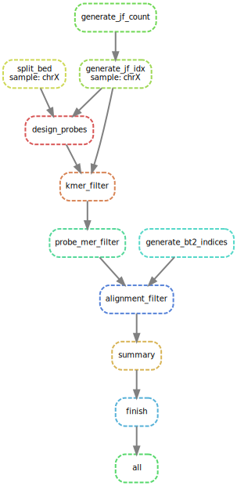

# Expected Pipeline Output

For a detailed description of pipeline output, see the [documentation](../../../docs/pipeline_output.md)


### Overview

Pipeline outputs are organized into three directories for both forms of implementation for `repeat_ID` and `defined_coords` implementation settings:

Folders shown in `repeat_ID` run mode:

| Folder        | Description                                                       |
|---------------|-------------------------------------------------------------------|
| [repeat_ID/01_reference_files/](repeat_ID/01_reference_files)   | files that may be of use in other pipelines or analyses |
| [repeat_ID/02_intermediate_files/](repeat_ID/02_intermediate_files)  | large intermediate files, useful when debugging, but otherwise disposable |
| [repeat_ID/03_output_files/](repeat_ID/03_output_files) | DNA probe .tsv file and probe to repeat summary |


Folders shown in `defined_coords` run mode:

| Folder        | Description                                                       |
|---------------|-------------------------------------------------------------------|
| [defined_coords/01_reference_files/](defined_coords/01_reference_files)   | files that may be of use in other pipelines or analyses |
| [defined_coords/02_intermediate_files/](defined_coords/02_intermediate_files)  | large intermediate files, useful when debugging, but otherwise disposable |
| [defined_coords03_output_files/](defined_coords/03_output_files) | DNA probe .tsv file and probe to repeat summary |

### Probes

Designed FISH probes are in the following locations:

| Item        | Location                                                       |
|---------------|-------------------------------------------------------------------|
| DNA FISH probes in .tsv format from repeat_ID | [repeat_ID/03_output_files/01_all_alignments/](repeat_ID/03_output_files/01_all_alignments) | 
| DNA FISH probes in .tsv format from defined_coords | [defined_coords/03_output_files/01_all_alignments/](defined_coords/03_output_files/01_all_alignments) |

### Reporting

An HTML report with diagnostics and detailed pipeline information can by generated with the following command:

```
$ snakemake --snakefile path/to/Snakefile --configfile path/to/config.yml --report pipeline_output/report.html
```

An example report is available [here](). For a visualization of the pipeline DAG structure, see: [pipeline.pdf](defined_coords/pipeline.pdf) or [pipeline.svg](defined_coords/pipeline.svg)

<div align="center">
    <a href="#Reporting"></a>
</div>
